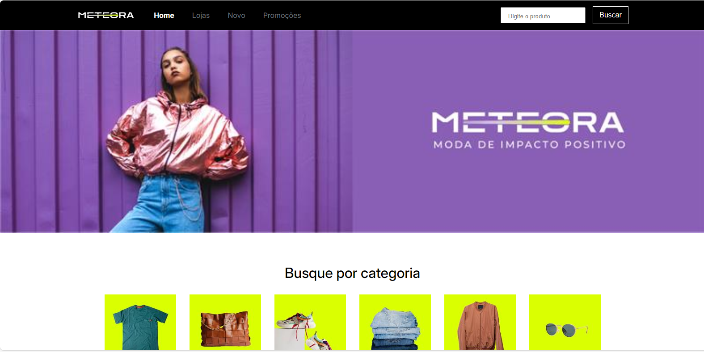

# meteora

> **Descrição curta do seu projeto**: site para uma loja de roupas fictício. O objetivo é treinar a progamação de layouts; 


[link do projeto](https://gustavo2606.github.io/meteora/)

## 🚀 Tecnologias Utilizadas

- **HTML5** – Estrutura do conteúdo.
- **CSS3** – Estilos e design responsivo.


### 1. Clonar o repositório
```bash
git clone https://github.com/SEU-USER/nomedoprojeto.git
 
